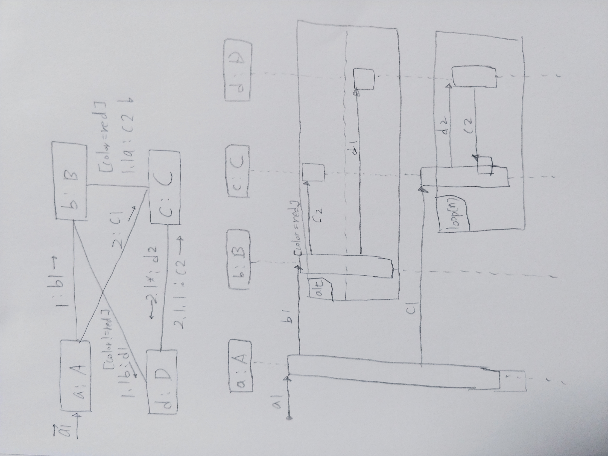

# OOAD
* Documents: https://github.com/woopsla/OOAD.git
* jungsun kim professor : kimjs@hanyang.ac.kr
* functional programming
* lambda : anonimous function
* Object
* domain / object analysis
* object / attribute
* Design Pattern  
  * Interface programming
  * Prefer composition to Inheritance
* What is OO design?
  * OO design is all about 'responsibility assignment' game under dependency management
* Unified Process : Larman Process
* Learn How to Think in Objects
  * Objects, Class, Inheritance, Polymorphism
  * UML, Unified Process (UP)
  * Layer Architecture : Agile
  * SOLID principles
* BOOK) Craig Larman - Applying UML and Patterns
* BOOK) Pascal Roques - UML in Practice
* BOOK) Doug Rosenberg - ICONiX
* BOOK) Design Patterns : GoF
* BOOK) Effective CPP : Scott Meyer
* Structured Thinking vs Object-Oriented Thinking (Shift of Responsibility)
* ```
  Abstraction, Encapsulation, Inheritance, Modularization
  --------------------- class ---------------------------
  --------------------- object --------------------------
  ```
* LSP
* Object : Entity with Unique Identity
* Real world ---(Abstraction)---> Software
* Object Oriented : Objects which have their own advantage solve the problems by collaborating with messages
* DDD (Domain Driven Design)
* ``` 
  DDD (Entity) = OO (Object)
  DDD (Value Object) = OO (Attribute)
  ```
* Object -> mutable (possible to update)
* Attribute -> immutable
* Service / Responsibility
* states = current value of each of the attributes (dynamic)
* Attribute = property
* client only depends interface
  * implementation changes often
* message = request for action
* receiver
* ```
  Interface (visible)
  -------------------
  Implementation (hidden)
  ```
* interface sharing (is_a) vs implementation sharing (code reuse)
* Public inhertiance should be used in 'is-a'
* ```
  Pure virtual : Interface
  Virtual function : overriding OK : Interface + Default implementation
  Nonvirtual function : overriding (X)
  ```
* compile time (pointer, reference) vs run time (dynamic dispatching)
 * static type vs dynamic type 
* message legal check : it is determined in static time
* receiver : dynamic type : it is determined in run time
* ```
  At Compile time                 At run-time
  ---------------                 ----------------
  static bining/early binding     dynaimc binding or late binding
  static functions in C++/Java    virtual functions in C++/Java
  nonvirtual functions in C#
  ```
* Business Logic (*)
# UML
* Model : Real projection
* Diagram : projection in another angle
* ```
              association name
  Person -------(works for)-------- Company
        employee               employer (Role name)
  ```
* Multiplicity : *, 0..* (zero to many), 0..1 (Zero or One)
* ```
         1..*    works for     *
  Person ------------------------- Company
         employee              employer
  ```
  ```
          married to
  MAN ------------------ WOMAN
      0..1            0..1

  <Multiple Association>

            Flies to
         *          0..1
  Flight ------------- AirPort
         -------------
         *           1
            Flies From
  ```
* ```
  Company ----------- Person
              |
              |
            job (Association Class)
  ```
* Association < Aggregation < Composition
  * Aggregation : part - whole, has-a
  * Composition : part - whole, has-a
    * ownership exclusive => parent destroy -> child destroy
    * ownership can be handed over
* Dependency : using relationship, you change -> I change
* Derived attribute, Derived Association
* <<permit>>
* disjoint vs overlapping
* vehicle <-- land vehicle, water vehicle <-- land/water vehicle
* ```
                       
            <<interface>>  <<use>>
  Book ---> Borrowable <--- Library

  Book ---O  <--------------  )---- Library  (ball/socket)
         provided       required
  ```
* is_a : subclass
* object diagram : runtime snapshot
  ```
  Professor : class
  :Professor
  ---------- : underline = instance/object
  kim: Professor  = named object
  ----------
  ```
* ```
  Driver --- can drive (link) --- Car
* Package : modeling element grouping
  * offer namespace
  * Package dependency : circular dependency should not happen
* LifeLive
# Communication Diagram, Sequence Diagram
* ```
  class A { void a1(){ b.b1(); c.c1();} }
  class B { void b1(){ if color == red, c.c2(); else d.d1() }
  class C { c1() { for(i=1; i<=n; i++) d.d2() }, c2(){} }
  class D { d1() {}, d2() {c.c2()} }
  a.a1();

  ```
  

# Unified Process (UP)
* iterative : Analysis / Design / Programming
* Martin Fowler, Robert Martin
* Use Case, Domain Model
* Iterative & Incremental
* Architecutre-Centric
* Use-Case Driven
  * discipline
* ```
  Inception > Elaboration > Contruction > Transition
  (Use Case)  (Domain Model)
              (Design Model)
  ```
* Object Design : Rebecca Wirfs-Brock
* C++ idioms : Jim coupline
* Actor is anything outside SuD that interacts with SuD (System under Design)
* Primary Actor, Supporint Actor (Indirection Layer)
* Use Case : Goal Level Proper
* Book : Writing Effective Use Cases
